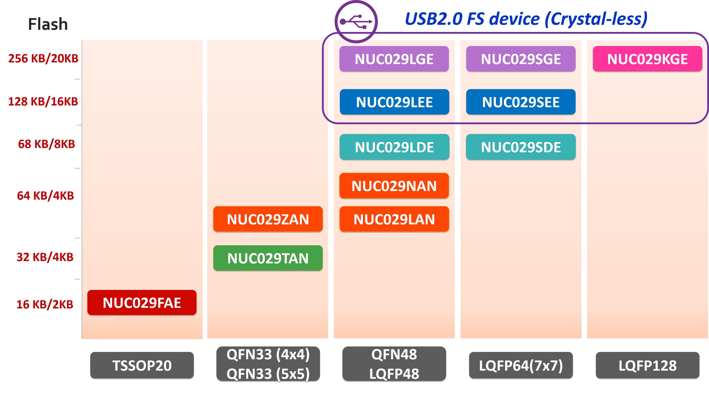

# [NUC029](https://github.com/SoCXin/NUC029)

* [nuvoton](http://www.nuvoton.com.cn/)：[Cortex-M0](https://github.com/SoCXin/Cortex)
* [L3R4](https://github.com/SoCXin/Level)：50 MHz  * 0.95 DMIPS/MHz

## [简介](https://github.com/SoCXin/NUC029/wiki)

[NUC029](https://github.com/SoCXin/NUC029) 针对工业控制设计的微控制器产品，具备高可靠性和高抗干扰能力。NuMicro® NUC029系列工作电压 2.5V ~ 5.5V ，工作温度 - 40°C ~ +105°C，工作频率24 MHz ~ 72 MHz ，Flash 16 KB ~ 256 KB ， SRAM 2 KB ~ 20 KB ，且支持丰富的外设，如12-bit ADC 、 UART 、 PWM 、 SPI 、 I²C 等。有些型号并支持除法器、比较器、USB 2.0全速装置。NuMicro® NUC029系列提供多样封装型式 ( TSSOP20、QFN33、QFN48、LQFP48、LQFP64、LQFP128 ) 以满足客户创新产品的需求。NuMicro® NUC029 SEE / LEE / SGE / LGE / KGE 具有USB 2.0全速通讯接口，可支持无需外挂晶振功能以节省材料成本与缩小产品尺寸。

### 关键特性

* 工作电压: 2.5 V ~ 5.5 V
* 工作温度: - 40°C ~ +105°C
* EFT 4.4 kV
* ESD 高达 HBM 8 kV (NUC029xAN_xAE/NUC029xDE)

### [资源收录](https://github.com/SoCXin/NUC029)

* [参考文档](docs/)
* [参考资源](src/)
* [参考工程](project/)

### [选型建议](https://github.com/SoCXin)

[NUC029](https://github.com/SoCXin/NUC029)

### [探索芯世界 www.SoC.xin](http://www.SoC.Xin)
